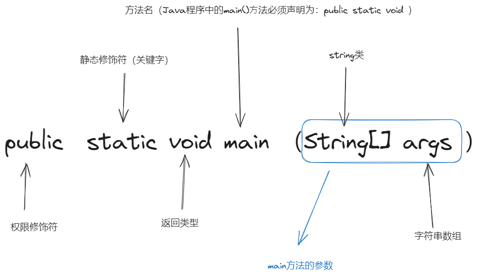

## 语法规范
```Java
public class HelloWorld{ //类名： 1. 首字母要大写  2.  源文件名与类名相同
	
	// 单行注释

	/* 多行注释
		除这两个之外还有文档注释。不重要
		
	 * /
	public static void main (String[] args){  
		/* 
		1. main()⽅法是类体中的主⽅法，该⽅法从{开始到}结束。
		2. Java程序中的main()⽅法必须声明为：public static void ，
		3. 方法名应该小写字母开头
		*/
		
		System.out.println("Hello world");   // 输出hello world   每一行代码结束必须要有;
	}
}

```



```bash
java  HelloWorld.java  // 编译
java HelloWorld // 运行
```
## 数据类型

### 常见数据类型
1. 基本数据类型
	1. 数值型
		1. 整数类型 ：int byte short long
		2. 浮点类型 ： float double
	2. 字符型（char）
	3. 布尔型（boolean）
2. 引用数据类型
	1. 类 class
	2. 接口 interface
	3. 数组 String []
> String不是⼀个数据类型，⽽是引⽤数据类型，属于Java提供的⼀个类


### 强制数据类型转换
>1. 当把⾼精度的变量的值赋值给低精度变量时，必须使⽤强制类型转换（⼜称为显式类型转换） 
>2. 语法规则：(类型名)要转换的内容
>3. 低精度转换⾼精度会导致精度丢失
```java
public class ChangeType { 
	public static void main(String[] args) { 
		int nNum = 10; double dNum = 10.8; 
		int ndNum = (int)dNum; 
		double dnNum = (double)nNum; 
		System.out.println("ndNum = "+ndNum); 
		System.out.println("dnNum = "+dnNum);
	}
}
```
运行结果：
```java
ndNum=10
dnNum=10.0
```

## 变量和常量

### 声明变量
```java
变量声明： 
1. 数据类型 变量名 [= 值] ;
2. 多个变量：数据类型 变量名1 ,变量名2 ; 

int a ,b, c   ;
double d = 1.0 ;
```


### 声明常量
> 常量 ：Java使用final关键字修饰常量   `final double PI =3.14；`
常量一般用大写字母

### 变量类型
1. 成员变量：作用域为整个类，可被权限修饰符修饰
2. 局部变量：作用域为当前方法，不能被权限修饰符修饰
3. 静态变量：作用域为整个类，使用static修饰，可以被权限修饰符修饰，其值在运行期间只有一个副本
4. 参数变量：方法定义 变量，参数变量的作用域限于方法内部

**123 变量：**
```java
public class RunoobTest {

    private int instanceVar = 10 ;    //成员变量：访问修饰符 变量类型 变量名
      
    private static int staticVar;  // 静态变量：访问修饰符 static 变量类型 变量名
    
    public void method(int paramVar) {
        
        int localVar = 40;  // 局部变量：变量类型 变量名
        
        // 使用变量
        staticVar = paramVar;
        
        System.out.println("成员变量: " + instanceVar);
        System.out.println("静态变量: " + staticVar);
        System.out.println("参数变量: " + paramVar);
        System.out.println("局部变量: " + localVar);
    }
    
    public static void main(String[] args) {
        RunoobTest v = new RunoobTest();
        v.method(50);
    }
}
```

123 运行结果：
```java
成员变量: 10
静态变量: 50
参数变量: 50
局部变量: 40
```


**4 变量：**
-  值传递：在方法调用时，传递的是实际参数的值的副本。当参数变量被赋予新的值时，只会修改副本的值，不会影响原始值。Java 中的基本数据类型都采用值传递方式传递参数变量的值。

```java
public class RunoobTest {
    public static void main(String[] args) {
        int a = 10, b = 20;
        swap(a, b); // 调用swap方法
        System.out.println("a = " + a + ", b = " + b); // 输出a和b的值
    }
    
    public static void swap(int x, int y) {
        int temp = x;
        x = y;
        y = temp;
    }
}
```

运行结果：
```java
a = 10, b = 20
```


-  引用传递：在方法调用时，传递的是实际参数的引用（即内存地址）。当参数变量被赋予新的值时，会修改原始值的内容。Java 中的对象类型采用引用传递方式传递参数变量的值。

```java
public class RunoobTest {
    public static void main(String[] args) {
        int[] arr = {10, 20};
        swap(arr); // 调用swap方法
        System.out.println("a = " + arr[0] + ", b = " + arr[1]); // 输出a和b的值
    }
   
    public static void swap(int[] arr) {
        int temp = arr[0];
        arr[0] = arr[1];
        arr[1] = temp;
    }
}
```
运行结果：
```java
a = 20, b = 10
```
### 多变量集合

#### 数组
#### 对象
#### 类
## 控制流程

### 判断

### 循环

## 函数定义与使用

